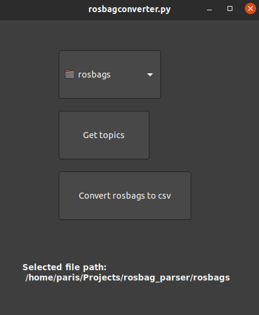

# Rosbag Parser

This is a Python project that utilizes the ROS (Robot Operating System) and Pandas libraries to process data from bag files and save the data on .csv files.

## Installation

1. Clone this repository.
   `git clone https://github.com/parisChatz/rosbag_parser.git`
2. Navigate into the project directory.
3. Install the required Python packages using pip.
   `pip install -r requirements.txt`

## Usage

1. Place your bag file(s) in a folder.
2. Run the script using the following command:
   `python3 rosbag_parser.py /path/to/rosbag/folder`
3. This creates csvs for each rosbag, with the same name and will be saved in the rosbag directory.

# Rosbag Converter Script

## rosbagconverter.py

This script allows you to convert rosbag files to csv format with a GUI. It uses rosbag_parser module to parse the rosbags.

## Usage

1. Run the script using the following command:
   `python3 rosbagconverter.py`
2. Use "Choose folder" button to select folder with rosbag files.
3. Click on "Get Topics" button to get common topics on all rosbags inside the selected folder.
4. Click on "Convert" button to start the conversion process.
5. Converted CSV files will be saved in the same folder where rosbag files are present with the same name as the bags.

